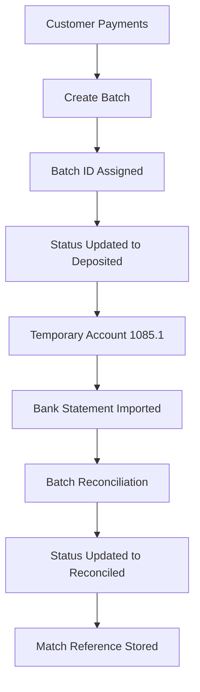

# Odoo Batch Payment Reconciliation System

## Business Problem

Finance teams were manually reconciling hundreds of payment transactions against bank statements.

Every payment had to be searched, selected, and matched individually, creating significant manual effort and reconciliation delays.

## Solution

Developed a custom Odoo Batch Processing Module that allows finance teams to group multiple payment transactions into a single deposit batch.

The system automatically tracks:

- Batch ID
- Deposit Status
- Reconciliation Status
- Bank Statement Match Reference

## Key Features

### Batch Creation

Group multiple customer payments into a single deposit batch.

### Status Tracking

- Blank
- Deposited
- Reconciled

### Audit Trail

Track every payment from collection through final reconciliation.

### Bank Statement Matching

Direct reconciliation against grouped deposits rather than individual payments.

## Technical Stack

- Odoo
- Python
- PostgreSQL
- XML
- Odoo Accounting

## Business Impact

- Reduced manual reconciliation effort
- Improved accounting accuracy
- Faster month-end closing
- Better audit visibility

  ## Workflow

