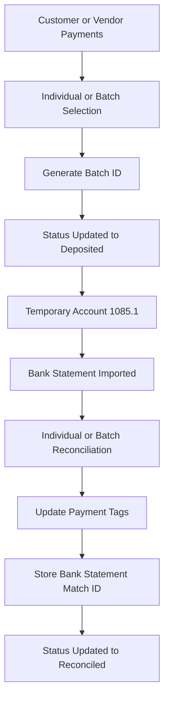

# Odoo Batch Payment Reconciliation System

## Overview

A custom Odoo Accounting solution designed to automate and simplify bank reconciliation workflows for both customer and vendor transactions.

The system enables finance teams to reconcile individual payments, grouped transactions, or entire payment batches while maintaining complete audit visibility and transaction traceability.

---

## Business Problem

Finance teams were manually reconciling large volumes of payment transactions against bank statements.

Every payment had to be searched, selected, and matched individually, creating:

* Significant manual effort
* Reconciliation delays
* Increased risk of human error
* Limited transaction visibility
* Slower month-end closing processes

---

## Solution

Developed a custom Batch Processing Module within Odoo Accounting.

The solution allows users to:

* Create payment batches
* Group multiple transactions
* Reconcile individual payments
* Reconcile grouped transactions
* Reconcile entire batches
* Track reconciliation lifecycle automatically

The system automatically stores reconciliation references, batch information, and bank statement match details.

---

## Key Features

### Batch Processing

Group multiple customer or vendor transactions into reconciliation batches.

### Flexible Reconciliation

Support for:

* Individual Payment Reconciliation
* Group Payment Reconciliation
* Batch Reconciliation

### Status Tracking

* Draft
* Deposited
* Reconciled

### Audit Trail

Track:

* Batch ID
* Reconciliation Status
* Deposit Status
* Bank Statement Match ID

### Bank Statement Integration

Automatically associate reconciled transactions with imported bank statement entries.

---

## Workflow



---

## Technical Stack

* Odoo
* Python
* PostgreSQL
* XML
* Odoo Accounting
* Bank Reconciliation Framework

---

## Business Impact

* Eliminated repetitive payment-by-payment reconciliation
* Reduced manual accounting effort
* Improved accounting accuracy
* Faster bank statement matching
* Better transaction traceability
* Improved audit visibility
* Increased finance team productivity
* Faster month-end closing process

---

## Documentation

Detailed workflow documentation is available in:

```text
docs/workflow.md
```
