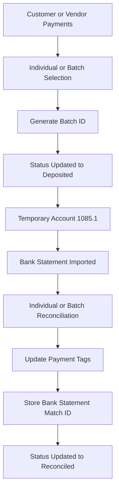

# Odoo Batch Payment Reconciliation Workflow

## Overview

The Batch Payment Reconciliation System was developed to reduce the manual effort required during bank reconciliation by allowing finance teams to process, group, and reconcile both customer and vendor payment transactions efficiently.

Instead of matching every payment individually against bank statement entries, users can reconcile individual payments, grouped payments, or entire payment batches while maintaining complete transaction traceability and audit visibility.

The system automatically updates reconciliation statuses, payment tags, and bank statement references across all related transactions.

---

## Existing Process Before Customization

### Challenges

Before implementing the solution:

1. Finance users processed multiple customer and vendor payments throughout the day.
2. Each payment was recorded separately in Odoo.
3. During reconciliation, users had to manually search and locate individual payment transactions.
4. Payments were matched one by one against bank statement entries.
5. Large bank deposits or withdrawals often represented multiple transactions.
6. There was limited visibility into which payments had been deposited or reconciled.
7. The process required significant manual effort and increased the risk of reconciliation errors.

### Business Impact

* Time-consuming reconciliation process
* High manual workload
* Difficult transaction tracking
* Limited visibility into reconciliation status
* Increased risk of accounting mistakes
* Slower month-end closing activities

---

## Custom Solution

A custom Batch Processing Module was developed inside Odoo Accounting.

The solution enables finance teams to:

* Group multiple customer payments into deposit batches
* Group vendor payments for reconciliation
* Reconcile individual payments directly
* Reconcile grouped transactions
* Track reconciliation status throughout the payment lifecycle
* Maintain complete audit history for every transaction

The system automatically updates payment records, status tags, batch references, and bank statement matching information.

---

## Workflow

---

## Batch Creation Process

### Step 1: Select Transactions

Finance users select one or more customer or vendor payment transactions belonging to the same deposit or reconciliation group.

### Step 2: Create Batch

The system generates a unique Batch ID and groups all selected transactions together.

Example:

Batch ID: DEP-2025-001

### Step 3: Update Deposit Status

All grouped transactions are automatically updated to:

* Deposited

This provides complete visibility into which payments have already been processed for bank reconciliation.

---

## Temporary Clearing Account

A temporary clearing account (1085.1) is used during the deposit process.

Purpose:

* Hold grouped transaction values temporarily
* Simplify reconciliation workflows
* Improve deposit tracking
* Provide accounting visibility
* Enable accurate matching with bank statements

---

## Reconciliation Process

### Step 1: Bank Statement Import

The bank statement is imported into Odoo.

### Step 2: Locate Matching Deposit or Withdrawal

The finance team identifies the corresponding bank statement transaction.

### Step 3: Reconcile Transactions

The system supports:

* Individual payment reconciliation
* Group payment reconciliation
* Batch reconciliation

Users can reconcile transactions directly against the imported bank statement entry.

### Step 4: Automatic Updates

Once reconciliation is completed, the system automatically:

* Updates transaction status to Reconciled
* Updates payment tags
* Stores the Bank Statement Match ID
* Maintains reconciliation history
* Preserves audit traceability

---

## Status Tracking

The system maintains transaction lifecycle visibility through status tags:

* Draft
* Deposited
* Reconciled

These statuses help finance teams quickly identify where each transaction is within the reconciliation process.

---

## Audit Trail Features

The solution stores:

* Batch ID
* Deposit Status
* Reconciliation Status
* Bank Statement Match ID
* Reconciliation References
* Customer Transaction References
* Vendor Transaction References

This allows users to trace every transaction from payment creation through final bank reconciliation.

---

## Results

The implementation delivered the following improvements:

* Eliminated repetitive payment-by-payment reconciliation
* Reduced manual reconciliation effort
* Improved accounting accuracy
* Faster bank statement matching
* Better transaction traceability
* Improved audit visibility
* Increased finance team productivity
* Faster month-end reconciliation process
* Improved reconciliation consistency across customer and vendor transactions

---

## Technologies Used

* Odoo
* Python
* PostgreSQL
* XML
* Odoo Accounting
* Bank Reconciliation Framework
